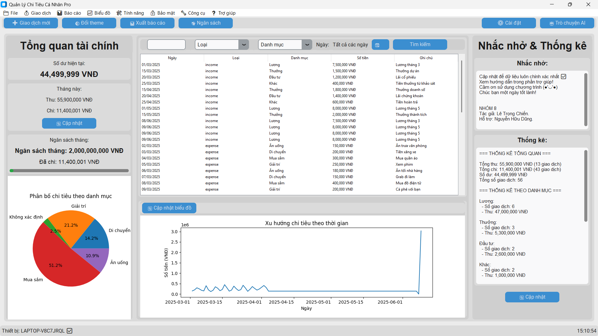

# 💰 Ứng dụng Quản lý Chi tiêu Cá nhân - Nâng tầm tài chính của bạn 💹

  

## 🚀 Giới thiệu

Ứng dụng Quản lý Chi tiêu Cá nhân là giải pháp toàn diện giúp bạn nắm quyền kiểm soát tài chính cá nhân một cách dễ dàng và hiệu quả. Với giao diện người dùng hiện đại, trực quan và các tính năng mạnh mẽ, ứng dụng cung cấp cho bạn cái nhìn sâu sắc về thói quen chi tiêu, thu nhập, và giúp bạn thiết lập, đạt được các mục tiêu tài chính một cách thông minh. Hãy để ứng dụng của chúng tôi đồng hành cùng bạn trên hành trình quản lý tiền bạc, hướng tới một tương lai tài chính vững chắc và thịnh vượng hơn.

## ✨ Tính năng nổi bật

  <table>
    <tr>
      <td align="center">
        
         
        💸 Quản lý Thu & Chi
      </td>
      <td align="center">
        
         
        📊 Báo cáo tài chính
      </td>
      <td align="center">
        
         
        📈 Biểu đồ trực quan
      </td>
    </tr>
    <tr>
      <td align="center">
        
         
        ⏰ Nhắc nhở & Mục tiêu
      </td>
      <td align="center">
        
         
        💾 Sao lưu & Khôi phục
      </td>
      <td align="center">
        
         
        🔒 Bảo mật dữ liệu
      </td>
    </tr>
  </table>

## ⬇️ Tải về ứng dụng

Để sử dụng ứng dụng ngay lập tức, bạn có thể tải về phiên bản cài đặt (.exe) mới nhất tại đây:

**[📥 TẢI XUỐNG NGAY](ĐIỀN_LIÊN_KẾT_TẢI_VỀ_FILE_EXE_CỦA_BẠN_VÀO_ĐÂY)**

## 🛠️ Yêu cầu hệ thống (Nếu bạn muốn chạy từ mã nguồn)

-   🐍 Python 3.8 trở lên
-   📦 Các thư viện Python cần thiết (xem `requirements.txt`)

## 📂 Cấu trúc thư mục

-   🏃 `run.py`: File khởi chạy chính của ứng dụng.
-   🧠 `quanlychitieu.py`: Class chính chứa logic nghiệp vụ và quản lý các module.
-   🖥️ `giao_dien.py`: Quản lý giao diện người dùng.
-   🔐 `bao_mat.py`: Xử lý bảo mật và mã hóa.
-   📊 `bieu_do.py`: Tạo và cập nhật biểu đồ.
-   📑 `bao_cao.py`: Tạo báo cáo tài chính.
-   ⚙️ `tinh_nang.py`: Các tính năng bổ sung như nhắc nhở, mục tiêu, kế hoạch.
-   🧮 `tinh_toan.py`: Xử lý các phép tính tài chính (lãi suất, thuế).
-   🔔 `thong_bao.py`: Quản lý thông báo và nhắc nhở hệ thống.
-   💾 `xuly_du_lieu.py`: Xử lý đọc, ghi và quản lý dữ liệu giao dịch.
-   ⚙️ `cai_dat.py`: Quản lý cài đặt ứng dụng.
-   🤖 `chatbot.py`: Module chatbot hỗ trợ người dùng (nếu có).

## 🗄️ Thư mục dữ liệu

-   📁 `data/`: Lưu trữ dữ liệu giao dịch.
-   💾 `backup/`: Lưu trữ bản sao lưu.
-   📊 `reports/`: Lưu trữ báo cáo.
-   📝 `temp/`: Lưu trữ file tạm thời.
-   🔑 `keys/`: Lưu trữ khóa mã hóa (nếu sử dụng).

## 📸 Ảnh chụp màn hình

Để thêm ảnh chụp màn hình ứng dụng của bạn, hãy tạo một thư mục `images/` trong thư mục gốc của dự án và đặt các file ảnh vào đó. Sau đó, bạn có thể tham chiếu chúng tại đây:

Ví dụ:

## 📖 Hướng dẫn sử dụng

1.  **➕ Thêm giao dịch**:
    -   Nhấn nút "Thêm thu" hoặc "Thêm chi".
    -   Điền thông tin giao dịch cần thiết.
    -   Nhấn "Lưu" để hoàn tất.

2.  **📊 Xem báo cáo**:
    -   Chọn "Báo cáo" từ menu chính.
    -   Chọn loại báo cáo bạn muốn xem (ví dụ: Thu theo tháng, Chi theo danh mục).
    -   Chọn khoảng thời gian mong muốn.
    -   Nhấn "Tạo báo cáo" để xem kết quả.

3.  **⚙️ Cài đặt ứng dụng**:
    -   Chọn "Cài đặt" từ menu.
    -   Thay đổi theme giao diện, đơn vị tiền tệ, hoặc ngôn ngữ.
    -   Quản lý các danh mục thu/chi của bạn.
    -   Nhấn "Lưu" để áp dụng các thay đổi.

## 📊 Thống kê dự án

  
  

## 🤝 Đóng góp

  
   
  Mọi đóng góp nhằm cải thiện ứng dụng đều được chào đón! Vui lòng tạo issue hoặc pull request trên GitHub của chúng tôi.

## 📄 Giấy phép

  
   
  MIT License 

 